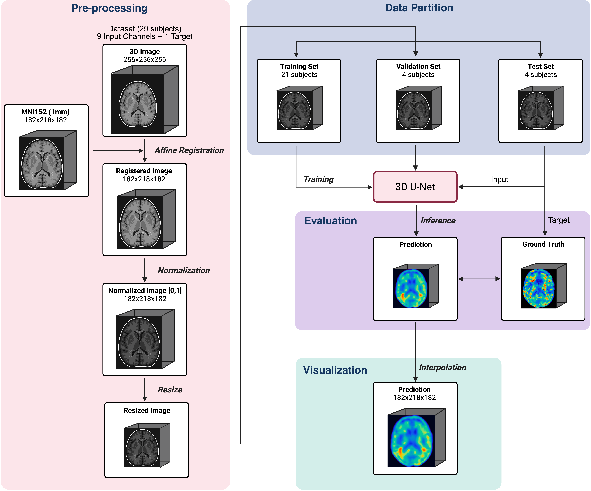

# brain-stiffness-prediction-dmri
Deep learning model for predicting brain stiffness from diffusion MRI as an alternative to MRE.

This project was developed as part of my Master’s thesis in the field of medical imaging and deep learning.

---

## Overview
Parkinson’s disease is a progressive neurodegenerative disorder, and early diagnosis remains a major challenge due to the limitations of current diagnostic tools, which are often invasive, expensive, and not widely accessible.

This project explores a novel approach to estimate **brain stiffness**, a key biomarker in neurodegeneration, using **diffusion MRI (dMRI)** instead of Magnetic Resonance Elastography (MRE).

The goal is to develop an accessible alternative for stiffness estimation using deep learning.

---

## Objectives
- Predict brain stiffness maps from diffusion MRI data  
- Replace or complement MRE with a more accessible imaging technique  
- Identify the most informative diffusion-derived parameters  
- Improve prediction quality using deep learning models  

---

## Methodology

### Data Processing
- Pre-processing of diffusion MRI data to ensure consistency and quality  

### Model
- 3D U-Net architecture for volumetric prediction  
- Patch-wise training to improve local feature extraction  

### Experiments
- Parameter ablation study to identify the most relevant inputs  
- Cross-validation on best-performing configurations  
- Region-based analysis for localized evaluation  

---

## Results
- **Best parameter:** Mean Diffusivity (MD)  
- **SSIM:** 0.755 ± 0.026  
- **MSE:** (0.171 ± 0.023) × 10⁻²  
- **PSNR:** 22.894 ± 0.606  

**Key findings:**
- Most diffusion parameters provide comparable predictions  
- Patch-wise training improves visual resolution  
- Trade-off observed between visual quality and quantitative metrics  

